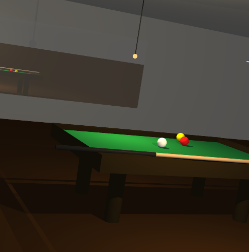

# RT
## Raytracer

Date du projet : 2018/01/26

## Contributeur : 
Thibault Vocanson
Romain Pinault
Yohann Hemme
Ludovic Lefevre

## Bases du projet :
Cree un moteur 3d sur le principe du Raytracing en groupe de 4 perssonne

## Option :
- refraction
- reflection
- transparence

- filtre de modification
- application de texture sur les objects bmp/xpm

- gestion des objects negatif et extruder
- gestion des objects composer
- fusion de scenes

- utilisation d'un bruit de Perlin
- gestion des object mathematique : plan, sphere, cone, cylindre, quadric

- parsing .txt et .json
- ombres avec plusieurs sources de lumiere

- lumiere colorer
- interface de modification live de la scene
- anti aliasing
- pixelisation

- changement de scenes sans reboot
- rotation des object simple et composer

- screenshot 
- mode "split" d'une meme scene

